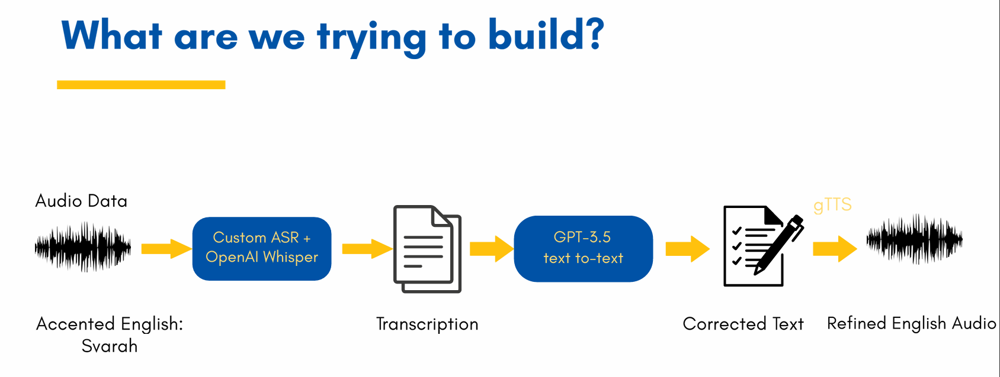

## English Accent Coach for Indian Speakers 🎤🌍

An AI-powered practice tool designed for Indian-accented English. It records user speech, runs transcription with Whisper and HuBERT, applies grammar correction through a transformer-based model, and generates a natural-sounding corrected version using Google Text-to-Speech. A lightweight Gradio app provides a voice-to-voice loop for interactive learning.
---

## 🎯 Objective

The system helps learners refine fluency and grammar in near real time by:

Capturing and analyzing speech

Generating corrected text transcripts

Returning audio feedback in a polished, native-like style

---

## 🧩 Main Components

| Task                | Technology / Library                                    |
|---------------------|---------------------------------------------------------|
| Speech Recognition  | OpenAI Whisper, HuBERT                                  |
| Grammar Correction  | Hugging Face model `prithivida/grammar_error_correcter_v1` |
| Speech Synthesis    | Google Cloud TTS (with gTTS as fallback)                |
| User Interface      | Gradio                                                  |
| Evaluation Metric   | Word Error Rate (WER) with `jiwer`                      |


---

## 🔂 End-to-End Flow

## 🗺️ System Overview



Steps in the pipeline:

🎧 Audio capture — user speaks or uploads .wav.

🛠️ Processing — audio resampled/normalized for model input.

📝 Transcription — Whisper + HuBERT produce raw text.

✨ Correction — grammar model improves readability/accuracy.

📊 Evaluation — WER is computed if a ground truth is supplied.

🔉 Playback — text converted back to speech with TTS.

🖥️ Interaction — Gradio shows results and plays output.

---

## 📂 Dataset

Training and evaluation were carried out on the Svarah dataset, which contains Indian-accented English samples from across regions.

📌 Dataset on Hugging Face

Format: .wav files

Applications: accent-focused ASR, fluency evaluation, and pronunciation tools

---

## 🛠️ Code Example

```
whisper_text = transcribe_whisper(audio_path)
hubert_text  = transcribe_hubert(audio_path)

refined_whisper = correct_text(whisper_text)
refined_hubert  = correct_text(hubert_text)

if ground_truth:
    whisper_score = wer(ground_truth, refined_whisper)
    hubert_score  = wer(ground_truth, refined_hubert)

text_to_speech(refined_whisper, "whisper_out.mp3")
text_to_speech(refined_hubert,  "hubert_out.mp3")
```

---

## 📊 Sample Output

```
Original:     so because when I have to make payment I do it by Apple Pay
Whisper:      So because when I have to make payment, I do it by April pay.
HuBERT:       SO BECAUSE WHEN I HAVE TO MAKE PAYMENT I DO IT BY A PULPET
Corrected Whisper: So when I have to make payment, I do it by April pay.
Corrected HuBERT:  When I have to make payment I do it by a pulpet.
Whisper Accuracy: 85.71%
HuBERT Accuracy:  71.43%
```

✔️ Outputs saved as:
- `whisper_output.mp3`
- `hubert_output.mp3`

---

## 🚀 Current Status

At present, the project functions as a working prototype. It demonstrates:

End-to-end transcription for accented English

Grammar correction using an LLM

Playback with synthetic speech

Progress

✅ Local prototype functional

✅ Speech-to-speech cycle complete

🔄 Gradio demo being refined

❌ Not yet deployed as a packaged application

Long-Term Aim

To develop a real-time companion app that enhances grammar, fluency, and pronunciation for Indian English speakers in classrooms, workplaces, and personal learning.

---

## 🔮 Planned Improvements

Regional accent fine-tuning with Svarah subsets

Hinglish and code-switching support

Stronger synthesis with Whisper Large + Tortoise TTS

Public demo on Hugging Face Spaces or Streamlit
---

## 📖 Research Basis

This project builds on work in accent-aware ASR and neural TTS, referencing:

Whisper ASR across accents – University of Cambridge

LLM integration in ASR – Peking University

Svarah dataset – AI4Bharat

HuBERT & BERT contextual speech embeddings

DNNs for speech recognition – University of Sharjah

---

## 👨‍💻 Contributors

- **Roshan A Rauof** 
- **Amritha K** 
- **Reem Fariha** 
- **Shifana Mehar** 

---

## 📌 Tags

`#ASR` `#SpeechToText` `#IndianAccentAI` `#LLM` `#Whisper` `#gTTS` `#Gradio` `#XAI` `#GPT35`

---

## 📖 Citation

If you use any of the tools or datasets in this project, please consider citing the following resources:

---

### 📌 Svarah Dataset

**Paper:**  
[Svarah: Evaluating English ASR Systems on Indian Accents (INTERSPEECH 2023)](https://www.isca-archive.org/interspeech_2023/javed23_interspeech.pdf)

```bibtex
@inproceedings{DBLP:conf/interspeech/JavedJNSNRBKK23,
  author       = {Tahir Javed and
                  Sakshi Joshi and
                  Vignesh Nagarajan and
                  Sai Sundaresan and
                  Janki Nawale and
                  Abhigyan Raman and
                  Kaushal Santosh Bhogale and
                  Pratyush Kumar and
                  Mitesh M. Khapra},
  title        = {Svarah: Evaluating English {ASR} Systems on Indian Accents},
  booktitle    = {{INTERSPEECH}},
  pages        = {5087--5091},
  publisher    = {{ISCA}},
  year         = {2023}
}
```

---

### 📌 OpenAI Whisper

**Paper:** [Robust Speech Recognition via Large-Scale Weak Supervision (2022)](https://cdn.openai.com/papers/whisper.pdf)

```bibtex
@misc{radford2022whisper,
  title        = {Robust Speech Recognition via Large-Scale Weak Supervision},
  author       = {Alec Radford and Jong Wook Kim and Tao Xu and Greg Brockman and Christine McLeavey and Jonas Schneider},
  year         = {2022},
  publisher    = {OpenAI},
  url          = {https://cdn.openai.com/papers/whisper.pdf}
}
```

---

### 📌 HuBERT (Facebook AI)

**Paper:** [HuBERT: Self-Supervised Speech Representation Learning by Masked Prediction of Hidden Units](https://arxiv.org/abs/2106.07447)

```bibtex
@article{hsu2021hubert,
  title   = {HuBERT: Self-Supervised Speech Representation Learning by Masked Prediction of Hidden Units},
  author  = {Wei-Ning Hsu and Benjamin Bolte and Yao-Hung Hubert Tsai and Kushal Lakhotia and Ruslan Salakhutdinov and Abdelrahman Mohamed},
  journal = {IEEE/ACM Transactions on Audio, Speech, and Language Processing},
  year    = {2021},
  url     = {https://arxiv.org/abs/2106.07447}
}
```

---

### 📌 Grammar Correction Model

Model: [`prithivida/grammar_error_correcter_v1`](https://huggingface.co/prithivida/grammar_error_correcter_v1)  
Author: Prithiviraj Damodaran (Hugging Face)

---

### 📌 Google TTS

Docs: [Google Cloud Text-to-Speech API](https://cloud.google.com/text-to-speech/docs)  
No formal citation required, but check usage guidelines.
